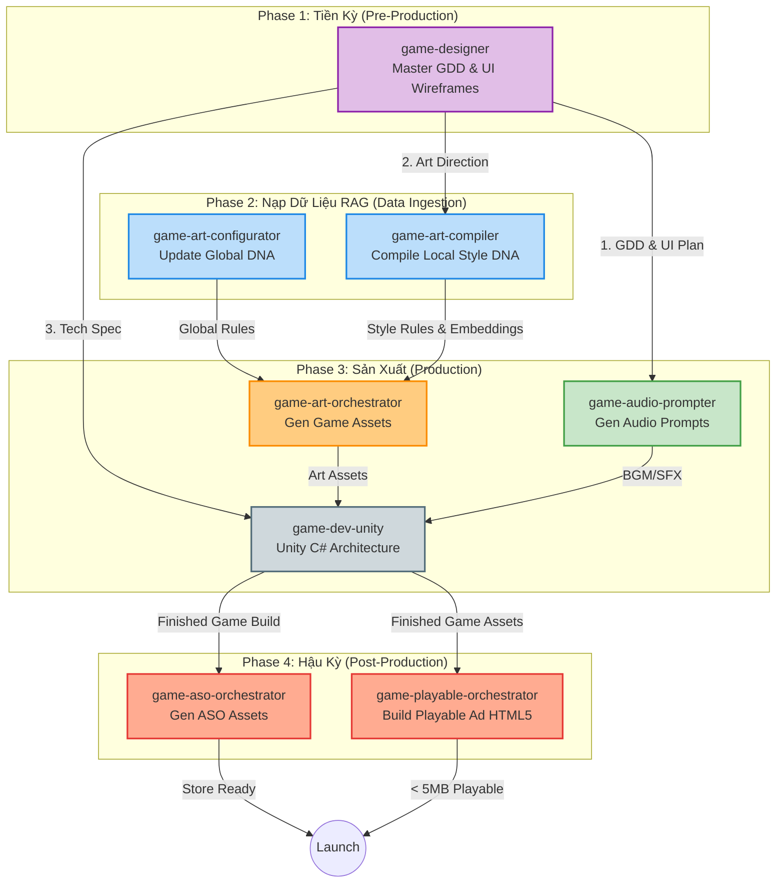

# 🎮 AI Game Studio: Hệ Thống Skills & Workflows

Tài liệu này hệ thống hóa toàn bộ vòng đời phát triển game (Game Development Lifecycle) được vận hành bởi bộ 8 AI Skills chuyên biệt. Mỗi skill đóng vai trò như một phòng ban (Department) thực thụ, tự động hóa từ giai đoạn lên ý tưởng thiết kế, sản xuất âm thanh/đồ họa, lập trình Unity, cho đến tối ưu hóa App Store và tạo Playable Ads.

---

## 1. Tổng Quan Vòng Đời (Pipeline Diagram)

Sơ đồ dưới đây minh họa luồng giao tiếp dữ liệu và thứ tự thực thi của 8 skills trong toàn bộ quy trình phát triển:

---

## 2. Phân Tích & Hướng Dẫn Sử Dụng Chi Tiết

> [!TIP]
> Bạn có thể gọi trực tiếp bất kỳ skill nào bằng cú pháp `@[/tên-skill] <yêu cầu>`.

### 🗂️ Giai Đoạn 1: Tiền Kỳ (Pre-Production)

#### 1. `game-designer` (Super Skill)
- **Mục đích:** Kỹ năng cốt lõi (Master Orchestrator) thiết kế Game Design Document (GDD). Chạy một pipeline tự động 6 bước.
- **Đầu vào:** Ý tưởng thô của user.
- **Đầu ra:** File `Master_GDD.md`, 5 file phân rã (Art, Audio, Dev, UI, Data), UI Wireframes (ASCII/Mermaid), và file `Integration_Map.md`.
- **Flow:** Chạy Phase 1 (Tạo GDD) -> Dừng lại đợi user duyệt -> Tự động chạy Phase 2 đến Phase 6 để tạo toàn bộ tài liệu kỹ thuật.
- **Lệnh gọi:** `@[/game-designer] Hãy lên thiết kế cho một game match-3 chủ đề ma thuật.`

### 🧠 Giai Đoạn 2: Chuẩn Bị Dữ Liệu RAG (Data Ingestion)

#### 2. `game-art-configurator`
- **Mục đích:** Quản lý tri thức (Knowledge Management). Cập nhật file `Global_DNA.md` (các quy tắc vật lý/nghệ thuật áp dụng chung) và tự động vector hóa (RAG database).
- **Đầu ra:** File `Global_DNA.md` cập nhật và `global_index.json`.
- **Lệnh gọi:** `@[/game-art-configurator] Thêm quy tắc: UI button luôn phải có viền dày 2px.`

#### 3. `game-art-compiler`
- **Mục đích:** Đóng gói phong cách nghệ thuật (Compile Artist Style). Biến 1 thư mục chứa các ảnh tham khảo thành cấu trúc Vector (RAG) và chiết xuất ra DNA sinh ảnh.
- **Đầu ra:** File `Generation_DNA.md` (Quy tắc sinh) và `Evaluation_Rules.json` (Quy tắc đánh giá chấm điểm ảnh).
- **Lệnh gọi:** `@[/game-art-compiler] Compile style cho thư mục Assets/GameArtist/StyleLibrary/SciFi.`

### 🛠️ Giai Đoạn 3: Sản Xuất (Production)

#### 4. `game-art-orchestrator`
- **Mục đích:** Tự động sinh Game Assets thực tế, tuân thủ nghiêm ngặt Global DNA và Local Style DNA thông qua RAG và Few-Shot Prompting.
- **Flow (Human-In-The-Loop):**
  1. Retrieve Style DNA bằng RAG.
  2. Bắt buộc vẽ **Sketch/Silhouette** trước -> Đợi user chốt.
  3. Áp dụng Render (Đổ màu/Ánh sáng) -> Chấm điểm (VLM Evaluator) -> Đợi user chốt.
  4. Cắt/Resize tự động (nếu là UI) -> Ghi log vào Asset Catalog -> Copy file vào thư mục dự án.
- **Lệnh gọi:** `@[/game-art-orchestrator] Vẽ một thanh kiếm lửa style Fantasy.`

#### 5. `game-audio-prompter`
- **Mục đích:** Dịch ngôn ngữ thiết kế từ GDD và Asset List sang cấu trúc Prompt chuyên dụng cho các Audio LLM (như Suno, Udio, ElevenLabs).
- **Đầu ra:** File `<ProjectName>_Audio_Prompt_Book.md` với các yêu cầu cực kỳ chặt chẽ về độ dài (milliseconds), Reverb, Texture, và Fatigue rules.
- **Lệnh gọi:** `@[/game-audio-prompter] Tạo prompt âm thanh cho project Hungry_Balls.`

#### 6. `game-dev-unity`
- **Mục đích:** Kỹ năng định tuyến (Router) cho toàn bộ quy trình code Unity. Bắt buộc phải thông qua các luồng planning và sử dụng các Dev Architecture patterns (Simplicity First, Surgical Changes).
- **Đầu ra:** Script C# hoàn thiện, tối ưu bộ nhớ, architecture patterns.
- **Flow:** Nhận yêu cầu -> Điều hướng đọc Sub-Skills (Physics, UI, Netcode...) -> Buộc chạy `/plan` -> Đợi duyệt -> Chạy `/execute` -> Kiểm tra lỗi `/debug` -> Hoàn thiện `/finish`.
- **Lệnh gọi:** `@[/game-dev-unity] Viết script quản lý object pooling cho đạn.`

### 🚀 Giai Đoạn 4: Hậu Kỳ (Post-Production)

#### 7. `game-aso-orchestrator`
- **Mục đích:** Tự động hóa việc lên ý tưởng và sản xuất bộ asset App Store Optimization (ASO).
- **Flow:**
  1. Đọc store link (tuỳ chọn) & Xác định Style -> Chốt ASO Plan.
  2. Vẽ phác thảo (Sketch) 1 Key Art + 1 Icon + 5 Screenshots -> Đợi user chốt.
  3. Render bản cuối cùng (Final) bằng công cụ sinh ảnh ở tỷ lệ 1:1, tự động resize/padding cho khớp.
- **Lệnh gọi:** `@[/game-aso-orchestrator] Lên bộ ASO cho game bắn súng zombie.`

#### 8. `game-playable-orchestrator`
- **Mục đích:** Trích xuất (Distill) nội dung từ Game chính để build thành Playable Ads (HTML5/Phaser 3) siêu nhẹ (dưới 5MB).
- **Flow:** Hoạt động qua 4 Phase độc lập (Ingest -> Harvest -> Dev -> Package). Bắt buộc dừng ở mỗi phase để đợi người dùng hô "Tiếp tục".
- **Đầu ra:** Một file HTML duy nhất chứa toàn bộ Logic, Base64 hình ảnh và SFX.
- **Lệnh gọi:** `@[/game-playable-orchestrator] Tạo playable ad cho game Hungry Balls.`

---

## 3. Autonomous Workflows & Interconnectivity

Điểm mạnh của hệ thống 8 skills này là **sự kế thừa ngữ cảnh**. Bạn không cần lặp lại thông tin:

1. **Từ GDD đến Sản Xuất**: Sau khi `game-designer` kết thúc (sinh ra file Markdown), bạn chỉ việc gọi `game-audio-prompter` và `game-dev-unity`. Hai skill này sẽ tự động chạy lệnh `view_file` để đọc Master GDD và Integration Map, biết chính xác game thuộc thể loại nào và cần làm gì.
2. **Từ Style Library đến Art Render**: `game-art-compiler` đã "dịch" hình ảnh mẫu thành số liệu RAG. Khi bạn gọi `game-art-orchestrator`, nó sẽ tự động chạy script python truy vấn DB, lấy ra các file hình ảnh Few-Shot và Text DNA để làm Prompt Generation mà bạn không cần phải đính kèm ảnh bằng tay.
3. **Từ Game Build đến Marketing**: `game-playable-orchestrator` sử dụng lại toàn bộ cấu trúc (GDD, Assets, Audio) có sẵn trong thư mục dự án và chuyển mã chúng sang TypeScript/Phaser 3 thay vì phải bắt đầu code từ số 0.

> [!IMPORTANT]
> **Quy tắc An Toàn (Safety Rules):** Tất cả các bộ phận sinh Code, vẽ Hình, làm ASO, và thiết kế GDD đều được khoá bằng cổng **Human-In-The-Loop**. Hệ thống sẽ luôn tạo Plan hoặc Sketch và dừng lại yêu cầu bạn `Approve` (Duyệt) trước khi chuyển sang bước tiêu tốn tài nguyên nặng (như Render hình ảnh chi tiết hay ghi đè hệ thống script cốt lõi).
