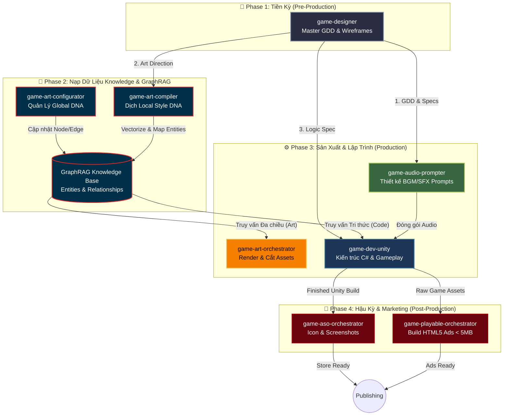

# 🎮 NTS Game Studio: Agentic Skills & Workflows Ecosystem

Chào mừng đến với hệ thống lõi của **NTS Game Studio**. Tài liệu này hệ thống hóa toàn bộ vòng đời phát triển game (Game Development Lifecycle), được vận hành hoàn toàn bởi một hệ sinh thái **AI Agentic Skills** độc lập và phối hợp chặt chẽ với nhau thông qua kiến trúc Model Context Protocol (MCP).

Mỗi Skill hoạt động như một phòng ban chuyên trách, tự động hóa từ khâu lên ý tưởng thiết kế, sản xuất âm thanh/đồ họa, lập trình C# trên Unity, cho đến tối ưu hóa App Store và đóng gói Playable Ads.

---

## 1. 🌐 Tổng Quan Hệ Sinh Thái & Kiến Trúc (Architecture Pipeline)

Sơ đồ dưới đây minh họa luồng giao tiếp dữ liệu liên tục và sự kết nối ngữ cảnh giữa 8 Skills trong suốt quy trình phát triển. Hệ thống đảm bảo tính kế thừa dữ liệu cao nhất, hạn chế tối đa việc lặp lại prompt từ phía User.

```mermaid
graph TD
    %% Define Styles
    classDef preProd fill:#2b2d42,stroke:#8d99ae,stroke-width:2px,color:#fff;
    classDef dataIngest fill:#003049,stroke:#d62828,stroke-width:2px,color:#fff;
    classDef prodArt fill:#f77f00,stroke:#fcbf49,stroke-width:2px,color:#000;
    classDef prodAudio fill:#386641,stroke:#a7c957,stroke-width:2px,color:#fff;
    classDef prodDev fill:#1d3557,stroke:#457b9d,stroke-width:2px,color:#fff;
    classDef postProd fill:#6a040f,stroke:#9d0208,stroke-width:2px,color:#fff;

    %% Phases
    subgraph phase1 ["📝 Phase 1: Tiền Kỳ (Pre-Production)"]
        GD[game-designer<br/>Master GDD & Wireframes]:::preProd
    end

    subgraph phase2 ["🧠 Phase 2: Nạp Dữ Liệu Knowledge & GraphRAG"]
        GACf[game-art-configurator<br/>Quản Lý Global DNA]:::dataIngest
        GAC[game-art-compiler<br/>Dịch Local Style DNA]:::dataIngest
        GraphDB[(GraphRAG Knowledge Base<br/>Entities & Relationships)]:::dataIngest
    end

    subgraph phase3 ["⚙️ Phase 3: Sản Xuất & Lập Trình (Production)"]
        GAO[game-art-orchestrator<br/>Render & Cắt Assets]:::prodArt
        GAP[game-audio-prompter<br/>Thiết kế BGM/SFX Prompts]:::prodAudio
        GDU[game-dev-unity<br/>Kiến trúc C# & Gameplay]:::prodDev
    end

    subgraph phase4 ["🚀 Phase 4: Hậu Kỳ & Marketing (Post-Production)"]
        ASO[game-aso-orchestrator<br/>Icon & Screenshots]:::postProd
        GPO[game-playable-orchestrator<br/>Build HTML5 Ads < 5MB]:::postProd
    end

    %% Flow
    GD -- "1. GDD & Specs" --> GAP
    GD -- "2. Art Direction" --> GAC
    GD -- "3. Logic Spec" --> GDU
    
    GACf -- "Cập nhật Node/Edge" --> GraphDB
    GAC -- "Vectorize & Map Entities" --> GraphDB
    
    GraphDB -- "Truy vấn Đa chiều (Art)" --> GAO
    GraphDB -- "Truy vấn Tri thức (Code)" --> GDU
    GAP -- "Đóng gói Audio" --> GDU
    
    GDU -- "Finished Unity Build" --> ASO
    GDU -- "Raw Game Assets" --> GPO
    
    ASO -- "Store Ready" --> Launch((Publishing))
    GPO -- "Ads Ready" --> Launch
```

---

## 2. 🧩 Phân Tích Chức Năng 8 Core Skills

> [!TIP]
> Bạn có thể gọi trực tiếp bất kỳ skill nào trong Agent bằng cú pháp `@tên-skill <yêu cầu>`.

### 📝 Giai Đoạn 1: Lên Ý Tưởng & Thiết Kế (Pre-Production)

#### 1. `game-designer` (Master Orchestrator)
- **Nhiệm vụ:** Trái tim của hệ thống thiết kế. Đảm nhận việc viết Game Design Document (GDD) toàn diện.
- **Đầu ra:** File `Master_GDD.md`, các file phân rã (Art, Audio, Dev, UI), bản vẽ UI Wireframes (bằng ASCII/Mermaid), và `Integration_Map.md`.
- **Luồng hoạt động:** Pipeline 6 bước tự động -> Lên ý tưởng cơ bản -> *User Duyệt* -> Sinh toàn bộ tài liệu kỹ thuật rẽ nhánh.

### 🧠 Giai Đoạn 2: Quản Lý Tri Thức & RAG (Data Ingestion)

Trước khi sản xuất Art, Agent cần "học" phong cách và quy chuẩn vật lý/đồ họa của dự án.

#### 2. `game-art-configurator`
- **Nhiệm vụ:** Quản lý `Global_DNA.md` (Quy tắc bao trùm toàn bộ dự án như viền UI, quy chuẩn an toàn, độ tương phản) và tự động Vector hóa đưa vào RAG Database.
- **Sử dụng khi:** Cần thiết lập hoặc thay đổi quy tắc Art/UI áp dụng trên toàn Game.

#### 3. `game-art-compiler`
- **Nhiệm vụ:** Dịch ngược một thư mục chứa ảnh mẫu (References) thành Cấu trúc dữ liệu Vector và xuất ra DNA Sinh Ảnh.
- **Đầu ra:** File `Generation_DNA.md` (Hướng dẫn prompt chi tiết) và `Evaluation_Rules.json` (Quy chuẩn cho VLM chấm điểm ảnh).

### ⚙️ Giai Đoạn 3: Sản Xuất & Lập Trình (Production)

#### 4. `game-art-orchestrator`
- **Nhiệm vụ:** Trực tiếp sinh ra Game Assets, ứng dụng triệt để Global DNA, Local DNA và Kỹ thuật Few-Shot Visual Prompting.
- **Tính năng đặc biệt:** 
  - Áp dụng hệ thống BFS-based Auto-Cropping để tách nền và cắt ảnh tự động.
  - VLM Evaluator tự chấm điểm tác phẩm trước khi giao cho User.
- **Flow:** RAG DNA -> Vẽ Sketch/Silhouette -> *User Duyệt* -> Render màu/ánh sáng -> *User Duyệt* -> Đóng gói vào dự án.

#### 5. `game-audio-prompter`
- **Nhiệm vụ:** Agent kỹ thuật âm thanh (Prompt Engineer). Dịch ngôn ngữ thiết kế từ GDD sang các Prompt chuyên sâu cho các nền tảng Audio LLM (Suno, Udio, ElevenLabs) với các tham số khắt khe về Reverb, Timing (ms), và Texture.

#### 6. `game-dev-unity`
- **Nhiệm vụ:** Kỹ sư phần mềm cốt lõi xử lý mã nguồn Unity C#. Tuân thủ triết lý *Simplicity First* và *Surgical Changes*.
- **Workflow bắt buộc:** Khảo sát Codebase bằng MCP (`view_file`, `mcp_unityMCP_*`) -> Bắt buộc gọi lệnh Plan -> *User Duyệt* -> Gọi lệnh Execute -> Kiểm thử lỗi -> Chốt công việc. Bắt buộc tra cứu tri thức từ `GEMINI.md` trước khi code.

### 🚀 Giai Đoạn 4: Hậu Kỳ & Marketing (Post-Production)

#### 7. `game-aso-orchestrator`
- **Nhiệm vụ:** Phân tích từ khóa, đối thủ trên Store và trực tiếp vẽ bộ Assets Marketing (Key Art, App Icon, Screenshots). Tự động canh lề (padding) và scale chuẩn 1:1 cho App Store/Google Play.

#### 8. `game-playable-orchestrator`
- **Nhiệm vụ:** Chiết xuất nội dung (Distillation) từ cấu trúc Unity để viết lại thành bản Playable Ad HTML5 nhẹ tênh bằng framework Phaser 3 (< 5MB).
- **Flow:** 4 Phase (Ingest -> Harvest -> Dev -> Package). Base64 hóa toàn bộ hình ảnh và âm thanh vào duy nhất 1 file `index.html`.

---

## 3. 🔄 Khả Năng Liên Kết Ngữ Cảnh Tự Động (Interconnectivity)

Hệ thống được thiết kế để loại bỏ thao tác nhập liệu thừa thãi. Bạn không cần mớm lại ngữ cảnh cho từng Skill:

- **Inheritance từ GDD:** Khi `game-designer` kết thúc, các kỹ sư phía sau (`game-dev-unity`, `game-audio-prompter`) tự động tìm kiếm đọc `Master_GDD.md` và `Integration_Map.md` để tự lấy Specs mà không cần bạn giải thích lại game làm về cái gì.
- **Data-Driven Art Generation:** `game-art-orchestrator` không yêu cầu bạn đính kèm ảnh mẫu. Nó tự động gọi RAG query từ kết quả của `game-art-compiler` để lấy Few-shot prompt.
- **Tái chế Asset làm Playable:** `game-playable-orchestrator` tự mò vào thư mục Unity lấy ảnh đã export, convert sang Base64 và code lại logic tương đương trên nền tảng Web.

> [!CAUTION]
> **Safety & Human-In-The-Loop Protocol:** 
> Bất kỳ thao tác nào tiêu tốn lượng tài nguyên lớn hoặc có khả năng phá vỡ cấu trúc (như Render ảnh Final, ghi đè Script C# cốt lõi) đều bị khoá chặt. Các Agents BẮT BUỘC phải đưa ra Plan (Kế hoạch), Blueprint (Bản vẽ nháp), hoặc Sketch (Phác thảo) và dừng lại chờ người dùng **Duyệt (Approve)** trước khi thực thi.
